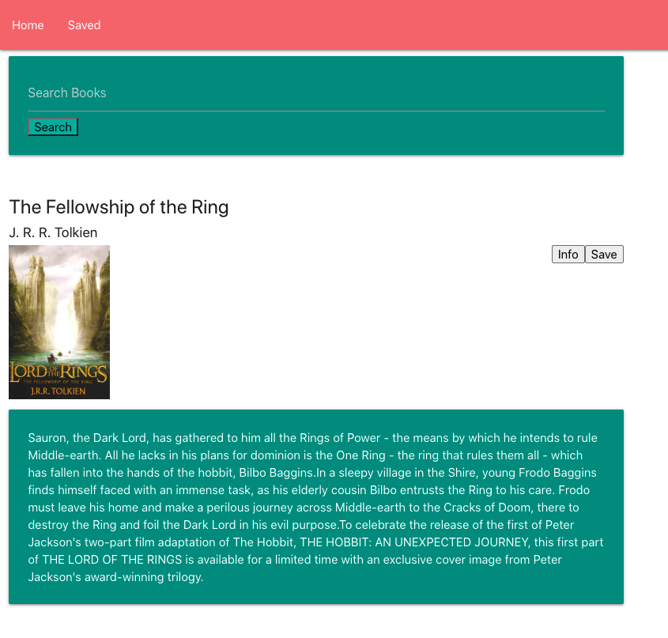

  # Google Book Search

  

  ## Description

  A quick fullstack react app that allowes you to search for books via the google books api. It was thrown together quickly in order to focus on project three.

  ## Images

  

  <a href="https://book-da-search-mon.herokuapp.com/" >Deployed Link</a>
  
  ## Table of Content

  * [Installation](#installation)

  * [Usage](#usage)

  * [License](#license)

  * [Contributing](#contributors)

  * [Contact](#questions/contact)

  ## Installation

  To Install necessary dependencies, run the following command:
  
  npm start

  ## Usage

      Search for a book and then if you save it and go to the saved page it will be there.
  
  ## Technologies

      Express, Node, React, Materialize, Javascript, CSS, Mongoose.

  ## Contributors

  Ben Hopkins

  ## Questions/Contact

  <a href="https://github.com/bh007183">GitHub Profile</a>
  <a href="mailto:bjhops17@gmail.com"> Email Me</a>
  
  

  